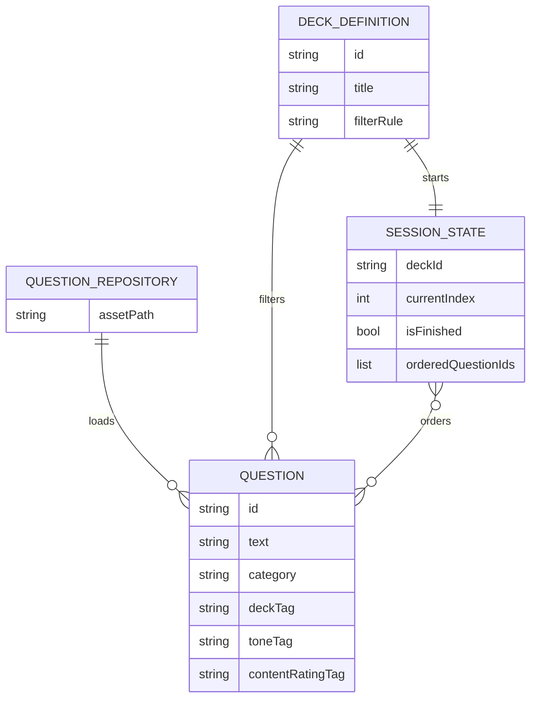
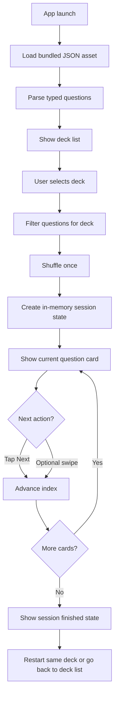

# Minimal Offline Flutter Questions App Research Report

## Executive summary

For MVP v0, the strongest architecture is a **single Flutter mobile app with no backend, no database, no auth, no persistence, and all question content bundled as a local JSON asset**. Flutter explicitly supports bundling JSON and other static data as app assets, declaring them in `pubspec.yaml`, and loading them at runtime from the app’s asset bundle. For a small proof-of-concept app, Flutter’s own JSON guidance favors **manual parsing** over code generation, and for a tiny two-screen flow, Flutter’s navigation guidance favors **plain `Navigator`** over heavy routing. citeturn32view0turn32view1turn23view1turn25view0turn25view3

For state, the best fit is **local ephemeral state** for the selected deck plus one in-memory session object containing a **single shuffled order created once at session start** and an index pointer that advances without repeats. Flutter’s built-in `StatefulWidget`/`setState` model is sufficient here; Flutter documents `provider` as a reasonable simple option for shared state, but this MVP does not need app-wide complexity. Riverpod is powerful, but its official docs position it as a broader reactive caching framework with optional linting and code generation, which is unnecessary overhead for v0. citeturn22search8turn21search8turn21search1turn21search7

For distribution, the cleanest paths are:

- **iOS:** normal App Store release, or **Unlisted App** if you want direct-link-only discovery while still using the official App Store update channel. Apple requires a normal app record, App Review, privacy disclosures, and a privacy policy URL for iOS apps. Unlisted requests are declined if the app has not been submitted for App Review or is still in beta/prerelease state. citeturn10view7turn10view8turn9view10turn10view9turn9view11turn13view0
- **Android:** **Google Play internal testing** is the fastest official-store path for one Android user. Google allows up to 100 internal testers, lets you start before the app is fully configured, and provides a shareable opt-in link. Apps active only on internal testing tracks are exempt from the Data safety section, which materially reduces setup friction for MVP v0. citeturn10view0turn29view0turn29view3turn27view3

Bottom line: **build the smallest possible Flutter app, bundle the questions locally, use manual typed parsing, use local ephemeral session state, ship iOS via App Store or Unlisted, and ship Android via Play internal testing.** That gets you official-store installs and store-managed updates without adding backend or persistence complexity. citeturn23view1turn25view0turn9view8turn19view3turn29view0

## Scope and assumptions

This report is intentionally scoped to **functional requirements only**. It excludes UI styling, backend architecture, auth, analytics, account systems, cloud sync, moderation, remote content updates, monetization, and code samples.

Assumptions for MVP v0, based on your brief:

| Item | Assumption |
|---|---|
| App type | Offline Flutter app for iOS + Android |
| Users | Two users total: you on iOS, your girlfriend on Android |
| Data source | Bundled local JSON only |
| Backend | None |
| Database | None |
| Persistence | None |
| Shared state between devices | None |
| Content updates after install | None |
| Gate / sign-in | None |
| Navigation | Deck list → session |
| Session rule | Shuffle once at session start, then advance with no repeats |
| Session retention | Lost on app kill / fresh launch |
| JSON path | Exact runtime asset path unspecified; assume repo source-of-truth is `data/questions.json` |
| App identifiers | App name, Dart project name, Android application ID, and iOS bundle ID are unspecified and must remain placeholders |
| Store plan | iOS: App Store or Unlisted. Android: Play internal testing |

A practical consequence of those assumptions: **you do not need a server at all for v0**. Bundled asset content plus in-memory session state is enough.

A naming caution matters early because both stores lock identifiers aggressively. Apple’s Bundle ID is the unique app identifier and must match the Xcode project; after a build is uploaded, you can’t change that property in App Store Connect. On Google Play, the `applicationId` is the unique app identifier, package names are unique and permanent, and once uploaded to Play the Application ID cannot be changed. Apple App Store names are capped at 30 characters; Apple subtitles are also capped at 30 characters; Google Play app titles are capped at 30 characters. citeturn18view4turn13view0turn9view14turn20view0turn10view2

## Recommended architecture and alternatives

### Core recommendation

Use a **single-app, local-content architecture**:

- a bundled questions JSON asset
- a thin asset-loading repository
- a typed question model
- optional typed deck-definition model
- one in-memory session state object
- two screens only: **Deck list** and **Session**
- one required gesture: **tap Next**
- one optional gesture: **swipe to advance**
- one minimal implicit animation on card transitions

Flutter’s asset system supports bundling JSON as runtime assets, declared in `pubspec.yaml`; asset paths are relative to `pubspec.yaml`, and the actual directory name does not matter. Flutter also recommends `DefaultAssetBundle` over direct `rootBundle` usage when practical, because it is friendlier to localization and testing. citeturn32view0turn32view1

### Typed parsing alternatives

Flutter’s own JSON guidance supports two approaches: manual parsing and code generation. For this app, manual parsing is the better fit. citeturn23view1turn23view0turn23view3

The table below synthesizes Flutter’s official JSON guidance. citeturn23view1turn23view0turn23view3

| Approach | Best fit per docs | Trade-off | MVP v0 verdict |
|---|---|---|---|
| Manual parsing with `dart:convert` | Smaller proof-of-concept / quick prototype | No extra deps; faster start; more runtime-error risk if schema drifts | **Recommended** |
| `json_serializable` code generation | Medium/large projects | Better compile-time safety and less boilerplate, but more setup and generated files | Not needed yet |

For this MVP, define **typed Dart models** anyway, even if parsing is manual. That preserves a clean upgrade path to `json_serializable` later without changing the app’s functional architecture. Flutter explicitly notes manual parsing is appropriate for smaller projects and code generation scales better when model complexity grows. citeturn23view1turn23view0

### State-management alternatives

Flutter’s state docs, the official provider package entry, and Riverpod’s official docs all point to a simple conclusion: your app is too small to justify a library. citeturn22search8turn21search8turn21search1turn21search7

| Option | What the source says | MVP v0 fit |
|---|---|---|
| `StatefulWidget` + `setState` | Built into Flutter’s mutable-state model; state changes should notify Flutter via `setState`. citeturn22search8turn22search0 | **Best fit** |
| `provider` | Flutter’s simple state-management guide uses `provider` and says newcomers with no strong reason to choose something else should probably start there. citeturn21search8turn9view5 | Fine, but unnecessary for two screens |
| Riverpod | Riverpod describes itself as a reactive caching framework and offers optional lint/codegen. citeturn21search1turn21search7 | Overkill for offline, no-persistence MVP |

**Recommendation:** keep session state in one local controller/state object owned by the session route. If deck definitions need to be visible on both screens, hold deck metadata as immutable app data and pass the selected deck into the session route.

### Navigation alternatives

Flutter says small applications without complex deep linking can use `Navigator`, and also says named routes are **not recommended for most applications**. For this app, `Navigator` with direct route pushes is the right call. citeturn25view0turn25view3turn24view1

| Option | Official guidance | MVP v0 verdict |
|---|---|---|
| `Navigator` + direct routes | Small apps can use `Navigator`; `push()`/`pop()` are the basic flow. citeturn25view0turn24view1 | **Recommended** |
| Named routes | Flutter docs do not recommend named routes for most apps. citeturn25view3 | Avoid |
| `Router` / `go_router` | Better for deep linking, web sync, advanced navigation. citeturn25view0turn25view3 | Not needed |

### Domain model for MVP v0

A minimal logical model is enough:

That is intentionally spare: one repository, immutable question data, optional deck metadata, and an in-memory session state.

## Functional implementation plan

### Project setup

Use Flutter’s current project bootstrap flow and start from the **empty template**. Flutter’s create-app docs explicitly allow `flutter create --empty` for a minimal `main.dart`, and project names should use `lowercase_with_underscores`. Before that, Flutter recommends installing Flutter itself and setting up the target platforms. citeturn15view2turn9view1turn9view0

For Android development, Flutter’s setup docs require the Flutter SDK, the latest stable Android Studio, SDK tools, Android license acceptance via `flutter doctor --android-licenses`, and environment validation with `flutter doctor`. citeturn16view2

For iOS development on macOS, Flutter’s setup docs require Xcode, Xcode command-line tools, accepting Xcode licenses, downloading iOS platform support, Rosetta on Apple Silicon, and CocoaPods if any plugin uses native iOS/macOS code. citeturn17view0turn17view1

### Asset bundling of questions JSON

Flutter treats JSON as a normal asset type. Assets are declared in the `flutter/assets` section of `pubspec.yaml`, are bundled into the asset bundle during build, and loaded at runtime. Flutter’s docs also note the directory name itself is arbitrary, which means you can keep the repo source-of-truth path or copy it into a conventional `assets/` path for clarity. citeturn32view0turn32view1

For this project, the cleanest practical split is:

- **source-of-truth assumption:** `data/questions.json`
- **runtime target inside Flutter app:** either keep that same path declared directly, or normalize to `assets/data/questions.json`

Because Flutter asset keys are just the logical paths declared in `pubspec.yaml`, either is valid if declared correctly. citeturn32view1

### Session mechanics

The session rule should be:

1. user selects a deck
2. app loads the bundled questions set
3. app filters by deck rule
4. app creates a **fresh copied list**
5. app shuffles **once**
6. app stores the resulting ordered IDs in memory
7. app shows the first card
8. each Next action increments the index
9. when the final card is reached, session is complete
10. returning to deck list discards session state unless you intentionally restart the same ordered set during the same route lifetime

Because there is **no persistence**, app restarts should be treated as a fresh launch. Within a still-running process, in-memory state may remain while the session screen is alive; across relaunches, it resets by design.

### Navigation and app flow

Use two routes only:

- **Deck list route**
- **Session route**

Flutter’s `Navigator.push()` / `Navigator.pop()` is enough for this exact flow. Named routes add no value here and are explicitly not recommended for most apps. citeturn24view1turn25view3

### Gestures and minimal animations

For taps, Flutter’s gesture docs recommend `GestureDetector` for fundamental interactions such as tapping and dragging. That makes it the right primitive if you implement a custom tappable card or gesture surface, though a standard button is even simpler for the required Next action. citeturn24view2turn5search0

For optional swipe-to-advance, Flutter documents swipe patterns via `GestureDetector` broadly and `Dismissible` specifically. For this app, swipe should remain **optional**, because the MVP requirement is satisfied by tap-only flow. If you do add swipe, it should advance the session rather than imply data deletion or permanent dismissal semantics. citeturn24view3turn24view2

For animation, Flutter’s docs recommend implicit animations for simpler cases, and `AnimatedSwitcher` is an especially good fit because it fades out the previous child and fades in the new child over a defined duration, with optional custom transitions. That is exactly enough for one-card transitions in MVP v0. citeturn9view7turn24view4

**Recommendation:** use exactly one minimal transition on card change, ideally `AnimatedSwitcher`, and stop there. Extra motion adds complexity without improving the core requirement.

### Testing recommendations

Flutter divides automated testing into unit, widget, and integration tests. Unit tests verify a single function/class, widget tests verify UI behavior in a lightweight test environment, and integration tests cover larger end-to-end flows on devices or emulators. For this MVP, unit tests plus a few widget smoke tests are sufficient. citeturn9view6turn26view1turn26view2

Recommended **unit tests**:

- JSON file loads successfully
- question parsing succeeds for representative records
- invalid/partial records fail predictably
- deck filters return expected subsets
- session shuffle creates a full permutation of the selected deck
- session advancement never repeats a question within one session
- empty-deck edge case renders a valid empty state

Recommended **widget smoke tests**:

- deck list renders after app startup
- tapping a deck enters session
- first question appears
- tapping Next advances to a different question
- final question transitions to finished state
- optional swipe gesture advances one card if enabled

Flutter’s widget-test tools for this are `flutter_test`, `WidgetTester`, `testWidgets`, finders, `tap()`, `drag()`, and explicit `pump()` / `pumpAndSettle()` after state changes. citeturn26view1turn26view0

## Distribution and store operations

### Store-path comparison

The table below summarizes the best distribution choices for *this* app.

| Path | Why it fits | Key constraints |
|---|---|---|
| iOS public App Store | Simplest Apple release path; normal App Store updates | Discoverable unless you later request unlisted |
| iOS Unlisted App | Direct-link-only discovery; still uses official App Store install/update channel | Must go through App Review first; not beta/prerelease |
| Android Play internal testing | Fastest official Android path for one private tester; shareable opt-in link | Up to 100 testers; not public/discoverable |

Apple’s unlisted distribution requires the app to be publicly distributed in App Store Connect configuration, submitted to App Review, and not remain in beta/prerelease; if approved, Apple changes the distribution method to **Unlisted App** and generates a direct link. Google Play internal testing distributes to up to 100 testers, lets you add testers by email list or Google Group, and provides a shareable link and opt-in page. citeturn10view9turn9view10turn29view0turn29view2turn29view3

### iOS build, signing, and release

Flutter’s iOS release docs say the release flow is:

1. register a unique Bundle ID
2. create an App Store Connect app record
3. review Xcode settings, including Bundle Identifier and signing
4. build an IPA
5. upload it to App Store Connect
6. submit for review and release citeturn18view0turn9view8turn10view10

Key Apple specifics:

- Every iOS app needs an Apple-registered Bundle ID. citeturn18view0
- App Store Connect app record must exist **before** upload. citeturn10view7turn10view8
- Xcode’s automatic signing is usually sufficient for simple apps. citeturn18view4
- `flutter build ipa` creates the `.xcarchive` and `.ipa`. citeturn9view8
- Upload can be done via Apple Transporter or command-line tooling. citeturn9view8
- Future updates use the **same app record** via “create a new version.” citeturn8search12

For **Unlisted App**:

- Keep App Store Connect distribution method as **Public**
- submit for App Review
- request unlisted distribution
- once approved, the app becomes direct-link-only and stays that way for future versions unless Apple changes policy/processes citeturn10view9turn9view10

Important Apple metadata/compliance items for this app:

- app name, subtitle, description, screenshots, keywords for the product page citeturn12view0turn12view1turn12view2turn12view3
- Support URL in platform version information citeturn11view3
- Privacy Policy URL is required for iOS apps citeturn13view0
- App Privacy answers are required to submit new apps and updates citeturn9view11turn12view0
- age rating is required citeturn10view6turn30search3
- screenshots: Apple requires one to ten screenshots in accepted image formats citeturn10view3
- if encryption/export questions apply, App Store Connect will require export compliance handling; Apple documents this explicitly for apps that use or include encryption. citeturn31search0turn31search10

For this fully offline MVP with no analytics or third-party data transmission, the likely Apple privacy posture is **“Data Not Collected”**, but that is an inference from Apple’s own definition of “collect” as transmitting data off-device in a way accessible beyond real-time servicing. If you later add analytics, crash reporting, remote config, or any third-party SDK, these answers can change immediately. citeturn9view11turn28search3

### Android build, signing, and release

Flutter’s Android release docs say Play Store publishing should use an **Android App Bundle**, and the Play Store prefers the app bundle format. Flutter builds it with `flutter build appbundle`, and the result is `app.aab`. citeturn19view3

Signing model:

- Android publishing requires signing with a digital certificate. citeturn19view0
- Flutter notes Android uses **two keys**: upload key and app signing key. citeturn19view0
- Google Play App Signing stores and manages the app signing key and signs optimized APKs generated from your app bundle. citeturn9view15turn8search2

Identifier/versioning specifics:

- `applicationId` uniquely identifies the app on Google Play and devices. citeturn20view0
- It should be unique and is effectively permanent after first upload. citeturn20view0turn9view14
- `versionCode` and `versionName` come from `pubspec.yaml` by default. citeturn20view2

For **internal testing**:

- internal testing releases are available to **up to 100 testers** citeturn10view0turn29view0
- you can start internal testing **before the app is fully configured** citeturn29view0turn33search11
- testers can be managed by email list or Google Group citeturn29view0turn29view2
- Play Console gives a shareable link, and testers opt in from that page citeturn29view0turn29view3
- internal tests may not be subject to the usual policy/security reviews, and apps active on internal testing tracks are exempt from Data safety inclusion citeturn29view0turn31search3

That means the Android MVP path is operationally much easier than production publishing.

### Minimal store metadata and privacy posture

For **iOS App Store / Unlisted**, prepare:

| Item | Status |
|---|---|
| App name | Required for product page |
| Subtitle | Product page metadata |
| Description | Product page metadata |
| Screenshots | Required upload asset |
| Bundle ID | Required, immutable after upload |
| Support URL | Required platform metadata |
| Privacy Policy URL | Required for iOS apps |
| App Privacy answers | Required for submissions |
| Age rating | Required |
| Keywords | Product page metadata |

Sources: Apple app information, product-page submission guidance, screenshot specs, app privacy, and age rating docs. citeturn13view0turn12view0turn10view3turn9view11turn10view6

For **Android internal testing only**, the minimum operational set is smaller:

| Item | Status for internal testing only |
|---|---|
| App record | Required |
| Unique package/application ID | Required and fixed after first artifact upload |
| AAB upload | Required |
| Play App Signing setup | Required on first release flow |
| Tester list / Google Group | Required |
| Feedback email or URL | Required on opt-in page |
| Store listing completeness | Can be deferred more than production |
| Data safety form | Exempt while active only on internal track |
| Privacy policy | Not the blocker if never leaving internal-only track; needed once you complete Data safety for broader release |
| Content rating / audience declarations | Needed for broader release/public readiness |

Sources: Play setup, release, internal testing, and Data safety help docs. citeturn9view14turn9view15turn10view0turn29view0turn27view3turn10view11turn10view12turn30search0

One important product-content caveat: because this app is question-based and may include intimate/explicit material, **age rating and content-rating answers must be filled truthfully on both stores**. Apple makes age rating mandatory; Google requires a content-rating questionnaire in Play Console. citeturn10view6turn30search3turn30search0turn30search2

## Codex AI agent task plan

### Ordered implementation tasks with file targets

This section is intentionally code-free and task-oriented.

#### Bootstrap the project

**Goal:** create the smallest possible Flutter mobile app shell.

**Tasks**
1. Create a new Flutter app from the empty template.
2. Set placeholder names:
   - Dart project: `questions_app`
   - Android application ID: `com.example.questionsapp`
   - iOS bundle ID: `com.example.questionsapp`
   - display name placeholder: `Questions App`
3. Keep iOS + Android targets only.
4. Verify local run on iOS simulator and Android emulator/device.

**Primary files**
- `pubspec.yaml`
- `lib/main.dart`
- `android/app/build.gradle.kts` or equivalent Gradle file
- `android/app/src/main/.../MainActivity.kt`
- `ios/Runner.xcodeproj`
- `ios/Runner/Info.plist`

#### Add the bundled content asset

**Goal:** make the repo question data available at runtime as an asset.

**Tasks**
1. Choose runtime asset path.
2. Either:
   - keep repository source file at `data/questions.json` and declare it directly, or
   - copy/normalize it to `assets/data/questions.json`
3. Declare the asset in `pubspec.yaml`.
4. Confirm app can load the file in debug builds.

**Primary files**
- `data/questions.json` or `assets/data/questions.json`
- `pubspec.yaml`

#### Define the domain layer

**Goal:** formalize the functional data model before building screens.

**Tasks**
1. Create typed model for a single question.
2. Create optional typed model for deck definition if deck logic is config-driven.
3. Create session-state type with:
   - selected deck ID
   - ordered question IDs
   - current index
   - finished flag
4. Add lightweight validation rules for invalid records.

**Primary files**
- `lib/domain/question.dart`
- `lib/domain/deck_definition.dart`
- `lib/domain/session_state.dart`

#### Build the local data layer

**Goal:** load and parse questions cleanly.

**Tasks**
1. Create asset loader abstraction.
2. Create repository that loads JSON text from assets.
3. Parse raw JSON into typed question models.
4. Expose fetch-all and fetch-by-deck methods.
5. Fail early on malformed schema rather than silently dropping data.

**Primary files**
- `lib/data/question_asset_loader.dart`
- `lib/data/question_repository.dart`

#### Define deck selection rules

**Goal:** support deck list → session flow without remote config.

**Tasks**
1. Decide whether decks are:
   - hard-coded filters over one JSON set, or
   - separate logical groups already represented in the JSON
2. Implement a single authoritative deck-definition list.
3. Ensure deck list screen only depends on that definition list, not UI copy scattered throughout the app.

**Primary files**
- `lib/domain/deck_definition.dart`
- `lib/features/decks/deck_catalog.dart`

#### Implement session creation logic

**Goal:** one-card-per-session, shuffle once, no repeats.

**Tasks**
1. On deck selection, fetch deck questions.
2. Copy the list.
3. Shuffle exactly once.
4. Convert to ordered ID list or ordered question list.
5. Set current index to zero.
6. Ensure rebuilds do not reshuffle.
7. On Next, increment index by one.
8. On final card, switch to finished state.
9. Do not persist any of this.

**Primary files**
- `lib/features/session/session_controller.dart`
- `lib/features/session/session_state.dart`

#### Implement the route structure

**Goal:** simple two-screen navigation.

**Tasks**
1. Create app shell and initial route.
2. Create Deck List route.
3. Create Session route.
4. Pass selected deck/session inputs through direct route construction.
5. Support back navigation to deck list.
6. Do not add deep linking or named-route indirection.

**Primary files**
- `lib/app.dart`
- `lib/features/decks/deck_list_screen.dart`
- `lib/features/session/session_screen.dart`

#### Implement required interactions

**Goal:** tap-first, swipe-optional.

**Tasks**
1. Add required Next action.
2. Add Previous only if you explicitly want it; otherwise omit for MVP purity.
3. Add optional swipe-to-advance behind a clearly isolated interaction layer.
4. Ensure disabled/finished logic is deterministic at end-of-session.

**Primary files**
- `lib/features/session/session_screen.dart`
- `lib/features/session/question_card.dart`

#### Add minimal card-transition animation

**Goal:** one subtle transition only.

**Tasks**
1. Wrap question-card content in one implicit animation primitive.
2. Key children so question changes actually animate.
3. Keep duration short and stable.
4. Avoid gesture-heavy animation physics for v0.

**Primary files**
- `lib/features/session/question_card.dart`
- `lib/features/session/session_screen.dart`

#### Configure app metadata placeholders

**Goal:** keep store-ready identifiers centralized.

**Tasks**
1. Set placeholder display name.
2. Set placeholder Android app ID.
3. Set placeholder iOS bundle ID.
4. Set placeholder version `1.0.0+1`.
5. Document all placeholders in README or release notes for later manual substitution.

**Primary files**
- `pubspec.yaml`
- `android/app/build.gradle.kts`
- `android/app/src/main/AndroidManifest.xml`
- `ios/Runner/Info.plist`
- `README.md`

#### Add baseline automated tests

**Goal:** smoke-test the core logic.

**Tasks**
1. Unit tests:
   - asset load
   - parse success/failure
   - deck filtering
   - shuffle/no-repeat invariants
   - end-of-session behavior
2. Widget tests:
   - app starts
   - deck list visible
   - tap deck enters session
   - tap Next advances
   - optional swipe advances if enabled
   - finished state appears
3. Run tests in CI if desired.

**Primary files**
- `test/unit/question_repository_test.dart`
- `test/unit/session_controller_test.dart`
- `test/widget/app_smoke_test.dart`
- `test/widget/session_flow_test.dart`

#### Prepare iOS release artifacts

**Goal:** produce App Store-ready iOS build.

**Tasks**
1. Finalize bundle ID placeholder substitution.
2. Verify signing team and auto-signing.
3. Set app version/build number.
4. Build IPA.
5. Upload to App Store Connect.
6. Fill in app metadata, privacy, age rating, support URL, privacy policy URL.
7. Submit for review.
8. If desired, request Unlisted distribution after public-style submission is in a valid reviewable state.

**Primary files**
- `ios/Runner.xcodeproj`
- `ios/Runner/Info.plist`
- App Store Connect app record

#### Prepare Android internal-testing release

**Goal:** get the Android app into official Play distribution fast.

**Tasks**
1. Finalize unique `applicationId`.
2. Configure Play App Signing.
3. Build signed AAB.
4. Create internal testing release.
5. Add tester list or Google Group.
6. Add feedback email.
7. Generate/share opt-in link.
8. Publish internal test release.

**Primary files**
- `android/app/build.gradle.kts`
- `pubspec.yaml`
- Play Console app record

### Condensed implementation checklist

- [ ] Empty Flutter app created
- [ ] iOS and Android targets run locally
- [ ] Question JSON bundled as asset
- [ ] Typed question model defined
- [ ] Deck definitions finalized
- [ ] Repository loads and parses bundled JSON
- [ ] Session controller shuffles once and never repeats within session
- [ ] Two-route flow implemented
- [ ] Tap Next implemented
- [ ] Swipe optional and isolated
- [ ] One implicit animation added
- [ ] No persistence anywhere
- [ ] Unit tests added for parse/filter/shuffle
- [ ] Widget tests added for deck → session → finish
- [ ] iOS identifiers/signing configured
- [ ] Android application ID/signing configured
- [ ] App Store metadata placeholders prepared
- [ ] Play internal-testing release published

## Open questions and limitations

A few things remain intentionally unresolved:

- The **exact repo JSON schema** was not re-verified in public docs during this research pass; this report assumes the earlier repo exploration was directionally correct and that `data/questions.json` is the source-of-truth path.
- The final **deck taxonomy** still needs one concrete definition pass: whether decks are explicit JSON fields, derived filters, or a curated mapping.
- The final **app name, bundle ID, application ID, support URL, and privacy policy URL** are still placeholders.
- The final **age-rating outcome** on Apple and Google depends on the exact wording and explicitness of the bundled questions; if intimacy or sexual content is meaningfully present, you should expect stricter ratings and must answer store questionnaires accordingly. citeturn10view6turn30search0turn30search2
- If you later add **sync, favorites, history, cross-device continuity, remote content, analytics, or crash reporting**, the recommended architecture changes immediately: privacy disclosures expand, persistence becomes necessary, and backend/local storage likely enters scope. citeturn9view11turn27view3